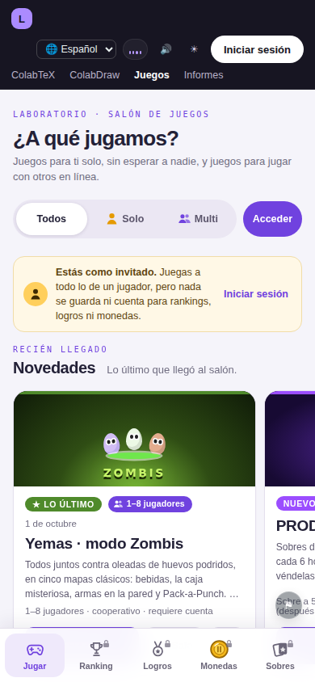
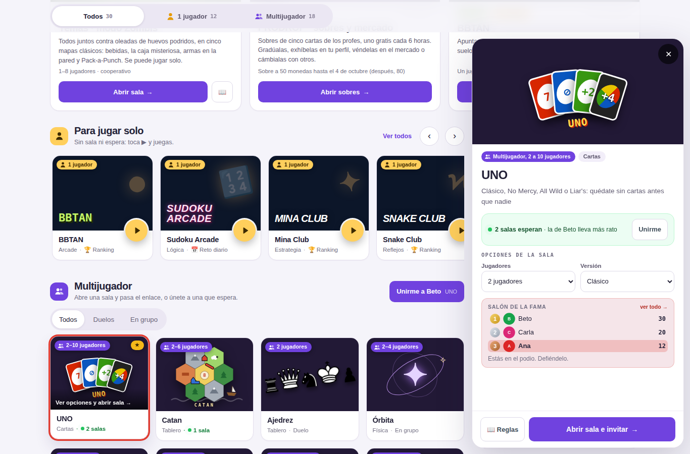
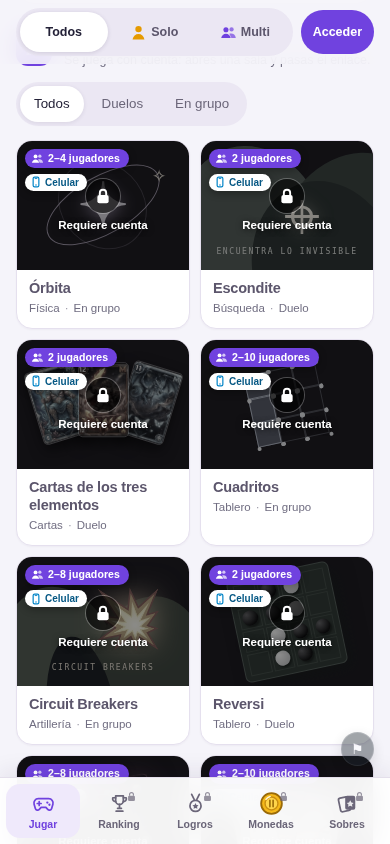
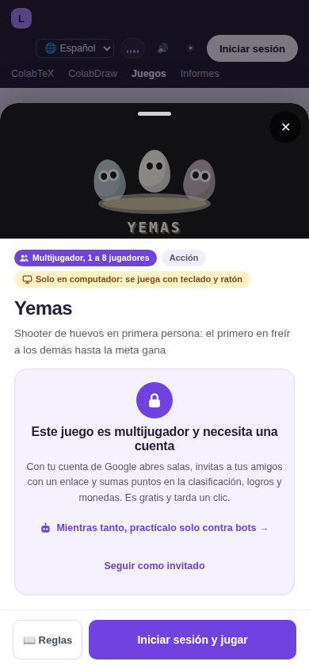
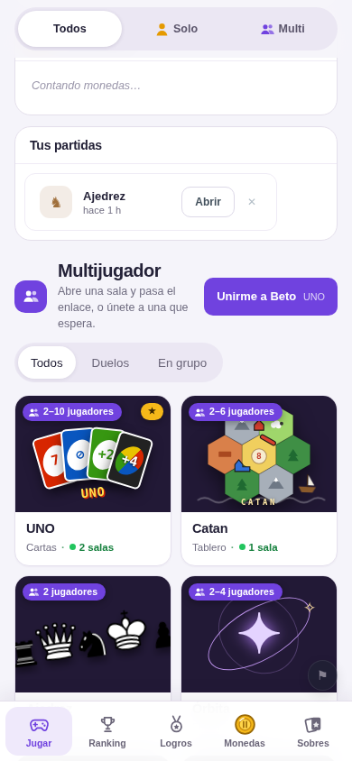
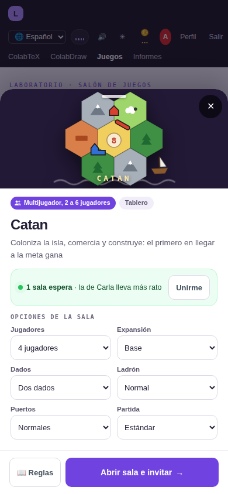
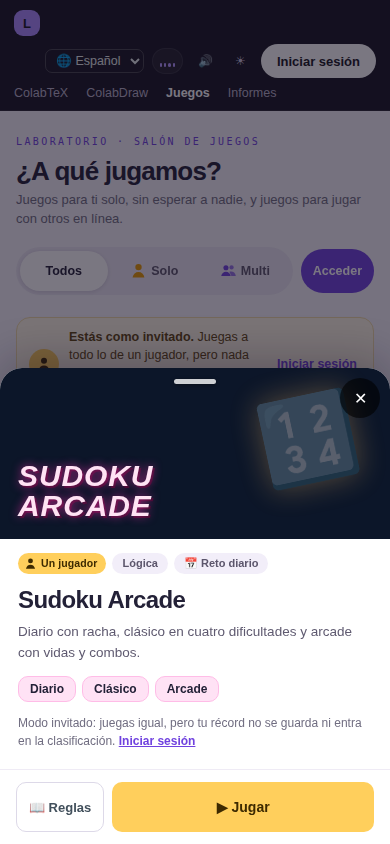
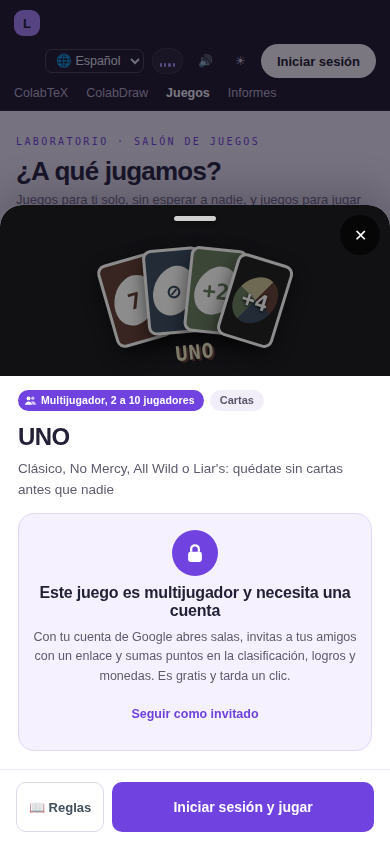
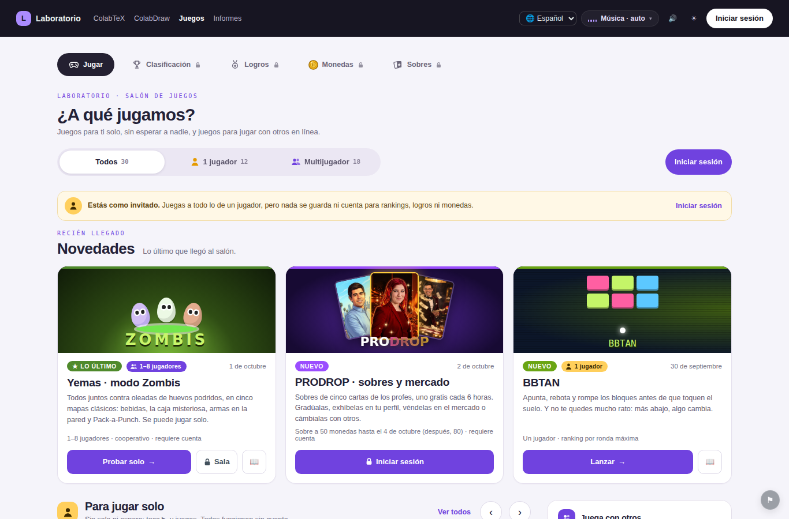
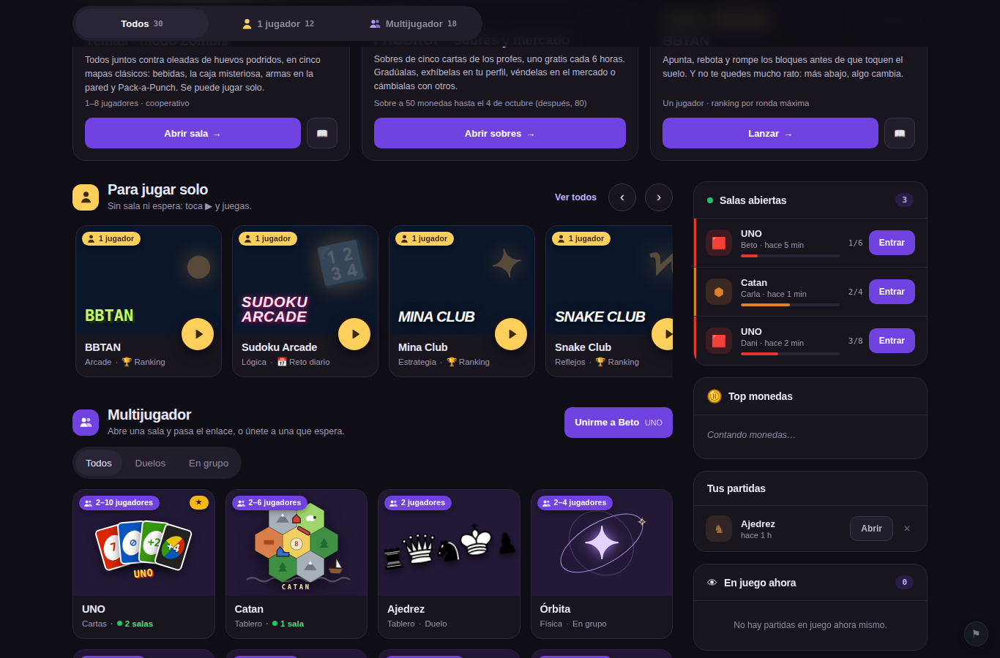

# Rediseño del salón de Juegos y modo invitado

Propuesta e implementación del nuevo menú principal de Juegos (`juegos.html`),
pensado primero para el celular. Cubre cuatro cosas: el **orden de las
secciones**, la **miniatura** de cada juego (con sus estados e interacciones),
el **comportamiento en móvil** y el **modo invitado**, incluido qué pasa cuando
un invitado toca un juego multijugador.

| Móvil, como invitado | Escritorio, con sesión y la ficha de UNO abierta |
|---|---|
|  |  |

## El problema de antes

- Los **18 multijugador ocupaban la pantalla** y los juegos de un jugador
  estaban en un bloque al final, después de todo el catálogo: en el celular,
  unas diez pantallas de scroll más abajo.
- Cada tarjeta multijugador traía sus opciones y su botón «Abrir sala»
  dentro, así que en el celular eran altas y el dedo podía abrir una sala sin
  querer (una sala aparece en la lista de todos y se anuncia en Discord).
- Sin sesión había un **muro**: una tarjeta de «Entrar con Google» y nada más.

## 1. Estructura: el orden de las secciones

De arriba abajo, igual en el celular y en el escritorio:

```
┌──────────────────────────────────────┐
│ Cabecera del sitio  [Iniciar sesión] │  ← siempre a la vista para el invitado
├──────────────────────────────────────┤
│ ¿A qué jugamos, Ana?                 │  1. saludo
│ [ Todos 30 | 👤 1 jugador 12 | 👥 Multijugador 18 ] [Entrar] │  2. barra de modo (pegada arriba)
│ (aviso de invitado, si lo es)        │  3. aviso discreto
│ NOVEDADES  ▸ ▸ ▸                     │  4. escaparate (carrusel en móvil)
│ 👤 PARA JUGAR SOLO  ▸ ▸ ▸ ▸           │  5. carrusel a la entrada
│ Salas abiertas · Tus partidas · …    │  6. columna de salas
│ 👥 MULTIJUGADOR  [Todos|Duelos|Grupo] │  7. rejilla multijugador
│ ▦ ▦                                  │
│ ▦ ▦                                  │
│ Últimos drops de PRODROP             │  8. tira (no es un juego: al final)
├──────────────────────────────────────┤
│ 🎮 Jugar  🏆 Ranking  🏅 Logros  🪙  🃏 │  barra de pestañas (solo móvil)
└──────────────────────────────────────┘
```

En pantalla ancha (más de 900 px) la columna de salas va a la derecha,
pegada, junto a las dos secciones de juegos:

```
┌───────────────────────────────┬──────────────┐
│ Saludo · barra de modo · aviso                │
│ Novedades (todo el ancho)                     │
├───────────────────────────────┬──────────────┤
│ 👤 Para jugar solo  ‹ ›        │ Salas        │
│ ▦ ▦ ▦ ▦ →                     │ abiertas     │
│ 👥 Multijugador                │ Top monedas  │
│ ▦ ▦ ▦ ▦                       │ Tus partidas │
│ ▦ ▦ ▦ ▦                       │ En juego     │
└───────────────────────────────┴──────────────┘
```

Por qué este orden:

- **Un jugador va justo debajo de las novedades** (objetivo 1): es lo único
  que se puede jugar *ya*, sin esperar a nadie, y es lo único que puede jugar
  un invitado. Como carrusel ocupa una sola fila, así que no empuja a los
  multijugador fuera de la vista.
- **La barra de modo** (objetivo 2) es la forma explícita de decir «hoy
  quiero jugar solo» o «hoy quiero jugar con otros». Queda pegada arriba al
  hacer scroll y se recuerda entre visitas. Elegir un modo esconde la sección
  que sobra; elegir «1 jugador» además convierte el carrusel en rejilla
  completa.
- **Las novedades no se esconden nunca** (objetivo 3): ningún modo las tapa.
- **En el móvil la columna de salas cae entre los dos tipos de juego**, justo
  antes del catálogo multijugador, que es donde se busca una sala.

## 2. La miniatura

### Anatomía

```
┌─────────────────────────┐
│[👥 2–10 jugadores] [NUEVO]│ ← insignia de modo (izq.) y etiqueta (der.)
│                         │
│        portada 4:3      │
│                    ( ▶ )│ ← solo en juegos de un jugador: «jugar ya»
├─────────────────────────┤
│ UNO                     │ ← nombre, hasta 2 líneas
│ Cartas · ● 2 salas      │ ← una línea de datos
└─────────────────────────┘
```

- **Tamaño y proporción**: la portada es **4:3** y la tarjeta mide 44 % del
  ancho en el carrusel del celular (se ven dos y un pedazo de la tercera, que
  invita a deslizar), dos columnas en la rejilla del celular, y unos 180–200 px
  en escritorio. El arte de cada juego se escala con el ancho de la tarjeta
  (consultas de contenedor), así que es el mismo dibujo en el carrusel, en la
  rejilla y en la ficha.
- **Imagen**: la portada ilustrada de siempre de cada juego. Los del Solo Club
  usan su fondo y su tipografía (el píxel de BBTAN, el neón del sudoku).
- **Título**: el nombre del juego, en 14,5 px, hasta dos líneas.
- **Datos**: una sola línea, para que todas las tarjetas midan lo mismo.
  Ejemplos: «Cartas · ● 2 salas» (multijugador con salas esperando),
  «Tablero · Duelo», «Arcade · 🏆 Ranking», «Lógica · 📅 Reto diario»,
  «Acción · Sin ranking» (práctica contra bots).

### Un jugador o multijugador, a simple vista

Lo distingue la **insignia de modo** de la esquina superior izquierda. Lleva
tres señales a la vez, para que funcione aunque no se distingan los colores:

| | Icono | Texto | Color |
|---|---|---|---|
| Un jugador | una persona | «1 jugador» | ámbar |
| Práctica contra bots | un robot | «Contra bots» | ámbar claro |
| Multijugador | dos personas | «2–10 jugadores» (el cupo real) | violeta |

Los mismos iconos y colores encabezan las secciones («Para jugar solo»,
«Multijugador») y la barra de modo, y aparecen en las novedades. Además, solo
los juegos de un jugador tienen el botón redondo ▶.

### Estados

| Estado | Cómo se ve | Cuándo |
|---|---|---|
| **Normal** | portada a color, borde suave | siempre |
| **Pasar el cursor** (solo con ratón) | la tarjeta sube 3 px, el borde toma el color del juego y en los multijugador aparece «Ver opciones y abrir sala →» sobre la portada | `:hover` / foco con teclado |
| **Seleccionada** | anillo de 3 px en el color del juego | mientras su ficha está abierta (`aria-expanded="true"`) |
| **Nueva** | etiqueta verde «NUEVO» con un brillo que pasa cada tanto | los 4 juegos que llegaron últimos, si llegaron hace menos de 14 días |
| **Más jugado** | etiqueta dorada «★ Más jugado» (solo ★ en tarjetas angostas) | el multijugador con más partidas |
| **Bloqueada para invitados** | portada en gris oscuro, candado y «Requiere cuenta» | invitado + juego multijugador |
| **Celular** | etiqueta blanca con un teléfono celeste, bajo la insignia de modo | el juego se puede jugar con el dedo en un teléfono |

### La etiqueta «Celular»

Dice qué juegos funcionan en un teléfono. Se decidió **jugando cada uno en
un celular emulado** (táctil, 390 × 844), no mirando si su pantalla cabe:
sortEm, por ejemplo, cabe entero, pero solo se mueve con las flechas.

- **Sí (28)**: los que tienen botones táctiles (Tetris, Snake, FANAL,
  Circuit Breakers…) y los que se juegan tocando (cartas, tableros, Pokémon,
  Clue, Mina Club, la Sopa…).
- **No (5)**: Yemas y su práctica (teclado y ratón, con el cursor
  capturado), Boxhead y su práctica (teclado) y sortEm (teclado). Su ficha lo
  avisa: «Solo en computador: se juega con teclado».

La lista vive en `MOVIL` (`salon-datos.js`), y la prueba del salón falla si
un juego nuevo no está en ella: nadie recibe la etiqueta sin que se haya
probado en un teléfono.

| La etiqueta en las miniaturas | Ficha de un juego que no va en el celular |
|---|---|
|  |  |



### Interacción

| Acción | Escritorio | Celular |
|---|---|---|
| Tocar / clic en la tarjeta | abre la **ficha** en un panel a la derecha; otra tarjeta la cambia; repetir el clic la cierra | abre la **ficha** como hoja que sube desde abajo |
| ▶ (solo un jugador) | juega directamente | juega directamente |
| Mantener presionado | — | abre la misma ficha, con una vibración corta |
| Cerrar la ficha | ✕, Escape o clic fuera | ✕, tocar el fondo o arrastrar la hoja hacia abajo |
| Teclado | Tab llega a cada tarjeta; Intro abre la ficha; Escape la cierra y el foco vuelve a la tarjeta | — |

La regla de fondo: **tocar la tarjeta nunca abre una sala ni empieza una
partida.** Solo abre la ficha. Así un roce del pulgar al hacer scroll no tiene
consecuencias. El único atajo es ▶, que existe únicamente donde no hay nada
que decidir antes (un juego de un jugador). Mantener presionado no esconde
ninguna acción propia: hace lo mismo que un toque, para quien lo intenta por
costumbre, y evita el menú de «guardar imagen» del navegador.

### La ficha (la vista expandida)

Es donde viven todas las opciones que antes apretaban la tarjeta:

| Multijugador (con sesión) | Un jugador | Multijugador (invitado) |
|---|---|---|
|  |  |  |

- **Multijugador con sesión**: las salas de ese juego que esperan (con
  «Unirme» a la más antigua), las opciones de la sala ya desplegadas, el podio
  del juego, 📖 Reglas (en la variante elegida), 📋 Equipos en Pokémon, y el
  botón principal **«Abrir sala e invitar»**: al abrirla, la sala muestra el
  enlace para pasárselo a quien quieras. Las opciones elegidas se recuerdan
  durante la visita.
- **Un jugador**: qué trae (modos o dificultades), si tiene reto diario o
  ranking, 📖 Reglas y **▶ Jugar**.
- **Multijugador para un invitado**: ver «Modo invitado» más abajo.

## 3. Comportamiento en móvil

- **Pulgar**: las pestañas (Jugar, Ranking, Logros, Monedas, Sobres) bajan a
  una **barra fija al pie**, con icono y nombre corto. En una partida o un
  juego del club se esconden: esas pantallas tienen su propio «volver». En la
  ficha, los botones van **al pie de la hoja**, a 50 px de alto.
- **Áreas táctiles** de 40 px o más (los botones de modo, ▶ de 44 px, los
  botones de la ficha de 48–50 px).
- **Scroll y carruseles**: novedades y «Para jugar solo» son carruseles con
  imán (cada deslizamiento deja una tarjeta alineada al borde); el multijugador
  es una rejilla de dos columnas; la barra de modo queda pegada arriba.
- **Etiquetas cortas** en pantallas angostas: «Solo», «Multi», «Acceder».
- **La hoja** sube desde abajo, ocupa hasta el 92 % del alto, se arrastra hacia
  abajo para cerrarla y bloquea el scroll de la página mientras está abierta.

## 4. Modo invitado

### Qué puede y qué no

- **Entra sin iniciar sesión**: sin muro. Quien llega sin sesión ve el salón
  completo en modo invitado.
- **Juega a todo lo de un jugador**: los nueve juegos del Solo Club (también
  Frontera Batalla) y la práctica contra bots de Circuit Breakers, Yemas y
  Clue. Son 12 juegos.
- **No se guarda nada**: ni ranking, ni logros, ni monedas, ni partidas en la
  nube. Lo que el juego guarde en el navegador con la cuenta «invitado» se borra
  al empezar otra visita (recargar la pestaña a mitad de partida no lo borra).
- **Los multijugador se ven, con candado**. Esconderlos le escondería al
  invitado la razón para crear una cuenta.

### Cómo se muestra (claro pero discreto)

- Una franja suave, en el ámbar de «un jugador», bajo la barra de modo:
  «**Estás como invitado.** Juegas a todo lo de un jugador, pero nada se
  guarda ni cuenta para rankings, logros ni monedas. *Iniciar sesión*».
- Dentro de un juego: «UN JUGADOR · MODO INVITADO, NO SE GUARDA» sobre el
  juego, y el panel de clasificación del juego dice por qué está vacío en vez de
  ofrecer «reintentar».
- Las pestañas Ranking, Logros, Monedas y Sobres llevan un candado pequeño.

### Iniciar sesión, en cualquier momento

El botón está siempre a la vista: en la cabecera, en la barra de modo (que se
queda pegada arriba), en la barra de cada juego, en la columna «Juega con
otros», en cada ficha bloqueada y en cada pantalla que pide cuenta.

### El choque con un juego multijugador

```
Invitado toca «UNO» (candado)
        │
        ▼
Se abre la ficha de UNO, en gris, con:
  🔒 «Este juego es multijugador y necesita una cuenta»
     Con tu cuenta abres salas, invitas con un enlace y sumas
     en la clasificación, logros y monedas.
  [ Iniciar sesión y jugar ]        ← botón principal, al pie
  «Mientras tanto, practícalo solo contra bots →»   (si existe)
  «Seguir como invitado»            ← cierra la ficha
        │
        ├─ Inicia sesión ─▶ la ventana de Google ─▶ vuelve a la MISMA
        │                   ficha de UNO, ya desbloqueada, con
        │                   «Abrir sala e invitar» a un toque
        │
        └─ Sigue como invitado ─▶ vuelve al salón, donde estaba
```

Otros dos caminos del mismo choque:

- **Un enlace a una partida** (`#p/…`) que le pasaron a un invitado: aparece
  una puerta «Te invitaron a una partida» con «Iniciar sesión con Google». Al
  entrar, la dirección no cambió, así que cae directo en esa sala.
- **Ranking, Logros, Monedas, Sobres o un perfil**: la misma puerta, con su
  propia explicación de qué hay detrás.



## 5. Decisiones y por qué

- **Sin cuenta anónima de Firebase.** Una sesión anónima cuenta como «con
  sesión» para las reglas de la base, así que el invitado podría escribir en
  rankings; además habría que activarla a mano en la consola. El invitado de
  esta propuesta simplemente no toca la base: no hace falta publicar reglas
  nuevas.
- **La ficha es modal en el móvil y no modal en el escritorio.** En el
  celular no hay sitio para ver la tarjeta y la ficha a la vez; en el
  escritorio sí, y poder ir tocando tarjetas mientras la ficha cambia es más
  rápido que abrir y cerrar un diálogo.
- **«Nuevo» es una regla, no una lista a mano**: los cuatro últimos de las
  dos últimas semanas. Con un juego nuevo cada pocos días, «todo lo de este
  mes» habría marcado a media tienda.
- **El color nunca va solo**: cada modo es icono + texto + color, para que
  sirva también a quien no distingue colores y al lector de pantalla
  (`aria-label` de cada tarjeta: «UNO. Multijugador, 2 a 10 jugadores. Ver
  detalles»).



## 6. Qué se tocó en el código

| Archivo | Qué |
|---|---|
| `colabtex/src/juegos/salon-datos.js` (nuevo) | Lo puro: el catálogo de un jugador, qué es nuevo, qué se bloquea, qué se borra al invitado. Sin navegador. |
| `colabtex/src/juegos/salon.js` (nuevo) | La miniatura y la ficha: toques, mantener presionado, arrastrar, teclado y foco. |
| `colabtex/src/juegos-main.js` | El nuevo armazón del salón, el modo invitado, las puertas y «iniciar sesión y continuar». |
| `juegos.html` | Estilos del salón (móvil primero, con su gemelo oscuro), barra inferior, y se quitó el CSS del vestíbulo viejo. |
| `colabtex/src/juegos/solo/club.js`, `juegos/club/conexion.js` | Los juegos del club en modo invitado. |
| `colabtex/src/juegos/frontera.js`, `pokemon/equipos.js` | La Frontera como invitado; de paso, arreglado que no abría para quien no tenía datos guardados. |
| `colabtex/tests/salon.test.cjs` (nuevo) | 6 pruebas de la parte pura. |
| `i18n/juegos.txt` | Traducciones de las etiquetas cortas nuevas. |

### Cómo probarlo

```
cd colabtex
node --test tests/salon.test.cjs     # la parte pura
npm run build && npm start           # y abrir http://localhost:8123/juegos.html
```

Sin iniciar sesión se entra como invitado. Para el celular, las herramientas
de desarrollo del navegador en modo dispositivo (390 × 844).
